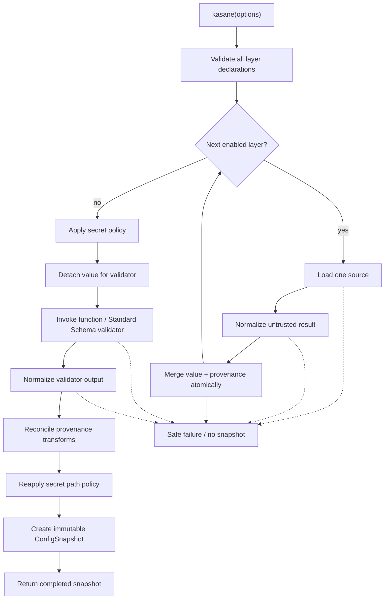
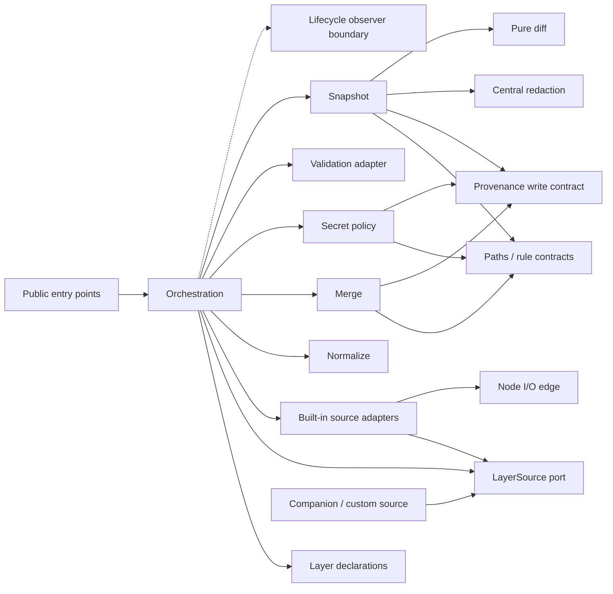

# Core architecture

Baseline: [requirements](./requirements.md) · [scope](./scope.md) ·
[assumptions](./assumptions.md) · [traceability](./traceability.md)

Accepted decisions: [ADR-0001](./adr/0001-core-pipeline.md) ·
[ADR-0002](./adr/0002-layer-order.md) ·
[ADR-0003](./adr/0003-extension-boundary.md) ·
[ADR-0004](./adr/0004-paths.md) ·
[ADR-0005](./adr/0005-validation-provenance.md) ·
[ADR-0006](./adr/0006-safe-serialization.md)

## Runtime pipeline

The per-layer part is strictly sequential. Validation contains output
re-normalization, provenance reconciliation, and a second secret-policy pass.

Lifecycle callbacks may observe safe boundaries around these stages. They have
no edge back into stage results and their exceptions do not lead to `Failure`.

## Module dependency graph

Arrows mean “may import/use”. Missing reverse arrows are intentional.

`Normalize`, `Merge`, `Paths`, `Provenance`, `Secret policy`, `Central
redaction`, and pure diff do not import Node I/O or source adapters. Source
adapters do not import merge, provenance writers, validation, or snapshot.

## Trust boundaries

```mermaid
flowchart LR
    TrustedCode["Trusted executable code\nsource / parser / validator"]
    Unknown["Returned unknown data"]
    Boundary["Normalize + limits + dangerous-key checks"]
    Canonical["Canonical ConfigNode"]
    Core["Pure merge / provenance"]
    Diagnostic["Diagnostic materialization"]
    Redactor["Central Redactor"]
    Safe["Safe public diagnostic"]

    TrustedCode --> Unknown
    Unknown --> Boundary
    Boundary --> Canonical
    Canonical --> Core
    Core --> Diagnostic
    Diagnostic --> Redactor
    Redactor --> Safe
```

Kasane does not sandbox trusted executable code. Its security guarantee begins
at the returned-data boundary and covers normalization, merge/provenance,
secret annotation, and library-owned diagnostics.

## Forbidden dependency matrix

| From | Forbidden target | Reason | Future enforcement |
| --- | --- | --- | --- |
| `merge` | `sources`, source adapters, Node I/O | Merge must remain pure and provider-neutral | `TS-ARCH` import rule |
| `normalize` | Sources, Node I/O, orchestration | Same unknown input must normalize identically everywhere | `TS-ARCH` import rule |
| `paths` | Sources, Node I/O, orchestration | Path grammar is a reusable deterministic leaf | `TS-ARCH` import rule |
| `redaction` | Sources, Node I/O, orchestration | One data-driven security policy, no environment behavior | `TS-ARCH` import rule |
| Source adapters | Merge, provenance writer, validation, snapshot | Sources load only | `TS-ARCH` import rule |
| Leaf modules | Orchestration | Dependency graph remains acyclic | `TS-ARCH` cycle/layer rule |
| Public entries/exports | `src/internal`, watch, providers, deep paths | Internals and post-1.0 capabilities are not contracts | `TS-ARCH`, `TS-PACKAGE`, `TS-ABSENCE` |
| Lifecycle callbacks | Config values or mutable stage results | Observation cannot alter behavior or expose secrets | Event type/security tests |

## State ownership

- Every `kasane()` call owns one orchestration context.
- Every snapshot owns bounded caches and immutable references.
- There is no global config, source/plugin registry, lifecycle bus, or mutable
  singleton.
- Adding a source is explicit construction plus placement in `layers`; it never
  mutates core registration state.

## Independent implementation seams

The accepted contracts let teams implement these areas independently:

- normalization against unknown-data fixtures;
- pure merge with a provenance write contract;
- provenance readers/history without source I/O;
- built-in and custom sources against `LayerSource`;
- validation adapter and reconciliation fixtures;
- snapshot/path/diff against immutable value and provenance readers;
- redaction against value/provenance canaries.

Integration is owned only by orchestration and the pipeline suites listed in
[traceability.md](./traceability.md).
