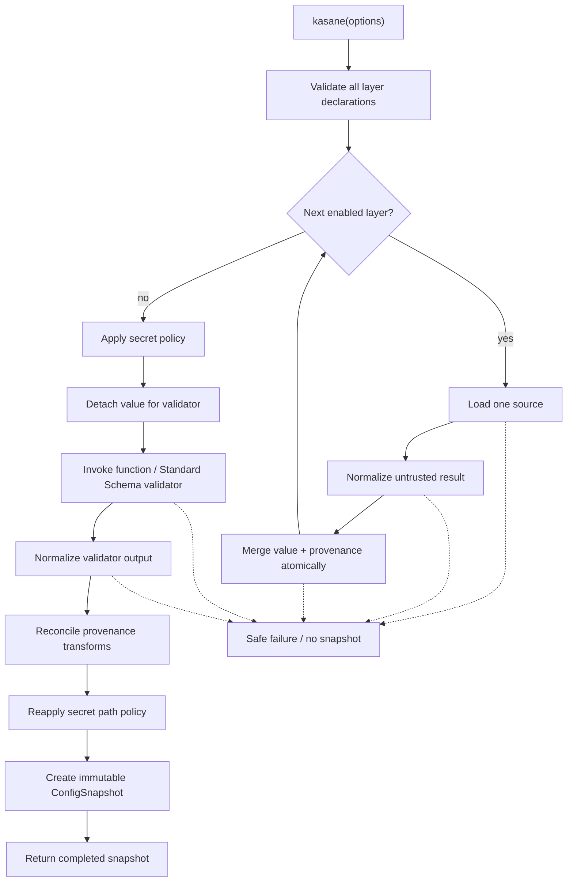
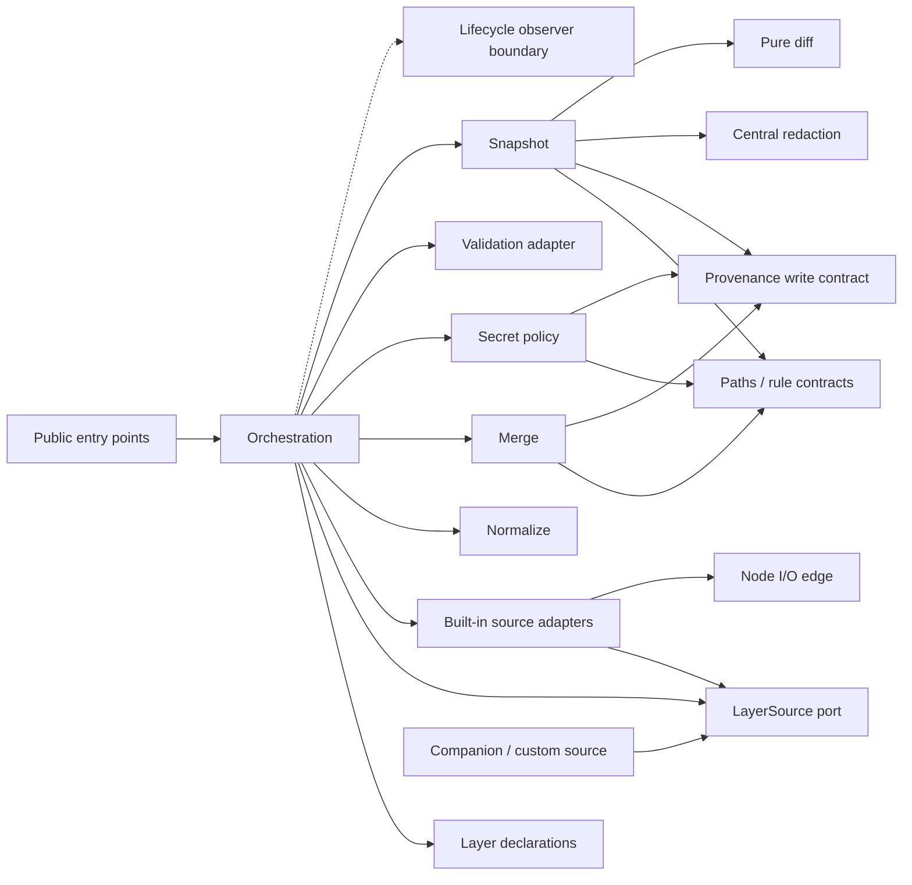

# Core architecture

Baseline: [requirements](./requirements.md) · [scope](./scope.md) ·
[assumptions](./assumptions.md) · [traceability](./traceability.md)

Accepted and superseded decisions are indexed in the
[ADR register](./adr/README.md). Public signatures and extension types are in
the [API reference](./api.md).

## Architectural invariants

Every change must preserve these invariants or introduce an accepted ADR that
explicitly changes the contract:

1. Layer order is visible precedence. Enabled sources complete
   `load → normalize → merge` strictly sequentially.
2. Unknown source and validator output crosses normalization and resource limits
   before it can become canonical data.
3. Merge updates value and provenance in one control flow; provenance is never
   reconstructed later from the final value.
4. A snapshot owns detached state. There is no global configuration, mutable
   source registry, event bus, or shared unbounded cache.
5. `snapshot.value`, `get()`, and `require()` are raw. Every library-owned
   diagnostic surface uses central structural redaction.
6. Sources load values only. They do not merge, validate, create provenance,
   apply redaction, or construct snapshots.
7. Paths have one parser and canonical serializer across merge, secrets,
   validation, provenance, snapshot access, and diff.
8. Failure and abort are atomic: no partial `ConfigSnapshot` is returned.
9. Stable package imports are limited to `@worldhacker/kasane` and
   `@worldhacker/kasane/standard-schema`.
10. Complexity and caching require measured benefit, bounded ownership, and
    unchanged public semantics.

## Runtime pipeline

The per-layer part is strictly sequential. Validation contains output
re-normalization, provenance reconciliation, and a second secret-policy pass.

Lifecycle callbacks may observe safe boundaries around these stages. They have
no edge back into stage results and their exceptions do not lead to `Failure`.

## Module dependency graph

Arrows mean “may import/use”. Missing reverse arrows are intentional.

`Normalize`, `Merge`, `Paths`, `Provenance`, `Secret policy`, `Central
redaction`, and pure diff do not import Node I/O or source adapters. Source
adapters do not import merge, provenance writers, validation, or snapshot.

## Trust boundaries

```mermaid
flowchart LR
    TrustedCode["Trusted executable code\nsource / parser / validator"]
    Unknown["Returned unknown data"]
    Boundary["Normalize + limits + dangerous-key checks"]
    Canonical["Canonical ConfigNode"]
    Core["Pure merge / provenance"]
    Diagnostic["Diagnostic materialization"]
    Redactor["Central Redactor"]
    Safe["Safe public diagnostic"]

    TrustedCode --> Unknown
    Unknown --> Boundary
    Boundary --> Canonical
    Canonical --> Core
    Core --> Diagnostic
    Diagnostic --> Redactor
    Redactor --> Safe
```

Kasane does not sandbox trusted executable code. Its security guarantee begins
at the returned-data boundary and covers normalization, merge/provenance,
secret annotation, and library-owned diagnostics.

## Forbidden dependency matrix

| From | Forbidden target | Reason | Future enforcement |
| --- | --- | --- | --- |
| `merge` | `sources`, source adapters, Node I/O | Merge must remain pure and provider-neutral | `TS-ARCH` import rule |
| `normalize` | Sources, Node I/O, orchestration | Same unknown input must normalize identically everywhere | `TS-ARCH` import rule |
| `paths` | Sources, Node I/O, orchestration | Path grammar is a reusable deterministic leaf | `TS-ARCH` import rule |
| `redaction` | Sources, Node I/O, orchestration | One data-driven security policy, no environment behavior | `TS-ARCH` import rule |
| Source adapters | Merge, provenance writer, validation, snapshot | Sources load only | `TS-ARCH` import rule |
| Leaf modules | Orchestration | Dependency graph remains acyclic | `TS-ARCH` cycle/layer rule |
| Public entries/exports | `src/internal`, watch, providers, deep paths | Internals and post-1.0 capabilities are not contracts | `TS-ARCH`, `TS-PACKAGE`, `TS-ABSENCE` |
| Lifecycle callbacks | Config values or mutable stage results | Observation cannot alter behavior or expose secrets | Event type/security tests |

## State ownership

- Every `kasane()` call owns one orchestration context.
- Every snapshot owns bounded caches and immutable references.
- There is no global config, source/plugin registry, lifecycle bus, or mutable
  singleton.
- Adding a source is explicit construction plus placement in `layers`; it never
  mutates core registration state.

## Independent implementation seams

The accepted contracts let teams implement these areas independently:

- normalization against unknown-data fixtures;
- pure merge with a provenance write contract;
- provenance readers/history without source I/O;
- built-in and custom sources against `LayerSource`;
- validation adapter and reconciliation fixtures;
- snapshot/path/diff against immutable value and provenance readers;
- redaction against value/provenance canaries.

Integration is owned only by orchestration and the pipeline suites listed in
[traceability.md](./traceability.md).

## Extension contract

`LayerSource` is the only provider extension port. A companion or application
source may load unknown data and honor `SourceContext`. It cannot access
accumulated configuration or any merge, provenance, validation, redaction, or
snapshot internals. The application constructs a `LayerDescriptor` explicitly
and places it in the ordered layer array; there is no plugin discovery or
registration. Built-in adapters may record safe input references internally,
but core `1.0` exposes no custom metadata registration hook.

Format integrations belong in a trusted parser passed to `file`. Schema
integrations use the structural Standard Schema contract. Watchers, CLI tools,
cloud providers, and telemetry are companion concerns and must consume only
public contracts. The full implementer-facing contract is in the
[API reference](./api.md#layerdescriptor) and
[ADR-0003](./adr/0003-extension-boundary.md).

## Where should a change go?

| Concern | Primary modules | Required invariants and tests |
| --- | --- | --- |
| Orchestration and layer order | `src/kasane.ts`, `src/layers` | Sequential order, preflight before I/O, atomic failure; integration and event suites |
| Unknown-data boundary | `src/normalize`, `src/security` | No unsafe type/key/cycle or over-budget value; unit, property, and security suites |
| Merge behavior | `src/merge` | Pure deterministic value/provenance update; exhaustive merge fixture and property suite |
| Provenance and history | `src/provenance` | Current origin/history/tombstone agreement and no secret plaintext; provenance and security suites |
| Secret handling | `src/secrets`, `src/diagnostics` | Central annotation/redaction/fingerprint rules; canary and hostile-object suites |
| Validation | `src/validation` | Detached input, renormalized output, reconciliation; validation and type suites |
| Snapshot, paths, diff | `src/snapshot`, `src/paths` | Isolation, bounded lookup, safe diagnostics, deterministic diff; snapshot/diff/security suites |
| Public package surface | `src/index.ts`, `src/standard-schema.ts`, `package.json` | No deep/internal export or external type leak; API, package, and consumer checks |

Internal file placement is not a public API promise. Imports must still follow
the dependency graph and the executable rules in `scripts/architecture-check.mjs`.

## Verification layers

Tests are intentionally overlapping because the strongest guarantees cross
module boundaries:

- unit tests fix local tables, error categories, normalization, provenance,
  redaction, snapshot, and diff behavior;
- integration tests fix layer scheduling, file/env behavior, abort, validation,
  and complete pipeline output;
- property/fuzz/security suites explore structural input, prototype hazards,
  paths, resource limits, secret canaries, and hostile executable boundaries;
- type tests and the declaration report fix inference and the public surface;
- architecture and packed-consumer tests fix dependency and package boundaries;
- benchmarks protect approved budgets but never authorize semantic changes.

Use `pnpm verify` as the ordinary gate. Add the focused command documented in
[CONTRIBUTING](../CONTRIBUTING.md) while iterating, but do not substitute it for
the full gate before review.

## Release boundary

A releasable commit is the exact commit that passed required Node/platform CI,
`pnpm verify`, package consumer checks, security gates, documentation/API drift,
and any applicable performance comparison. User-visible changes carry a
Changeset. Pull-request workflows have read-only permissions and no publish
credentials.

Publishing from a contributor workstation is outside the workflow. Until the
protected Changesets/trusted-publishing automation owned by `REL-001` is
present, maintainers prepare and audit artifacts but do not treat an ad-hoc
`npm publish` as a supported release process. See
[CONTRIBUTING](../CONTRIBUTING.md#how-are-releases-prepared) for the current
preparation checklist.
